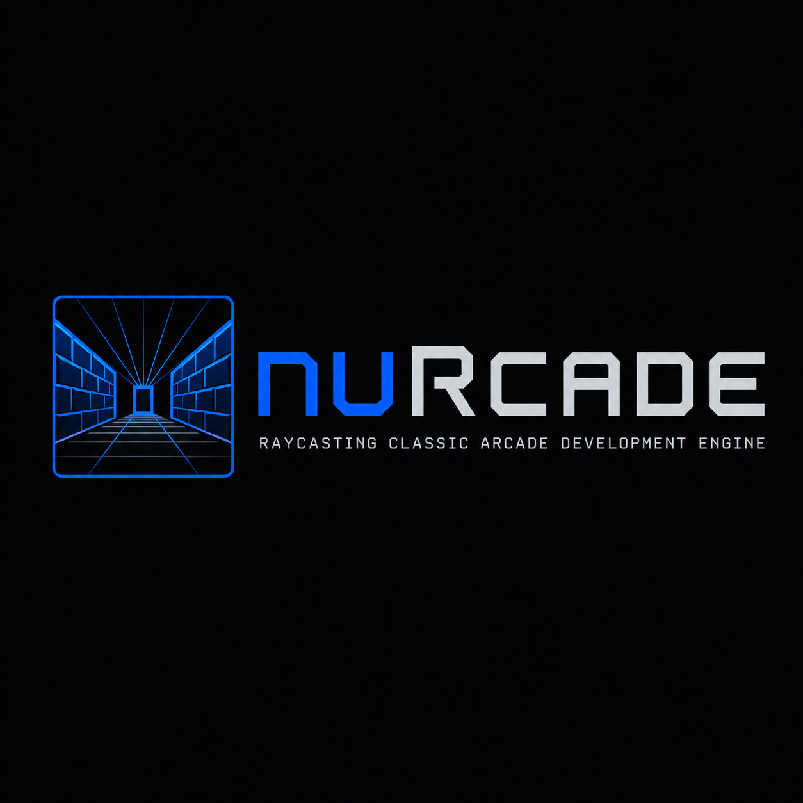
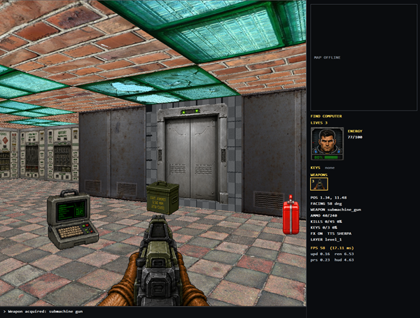
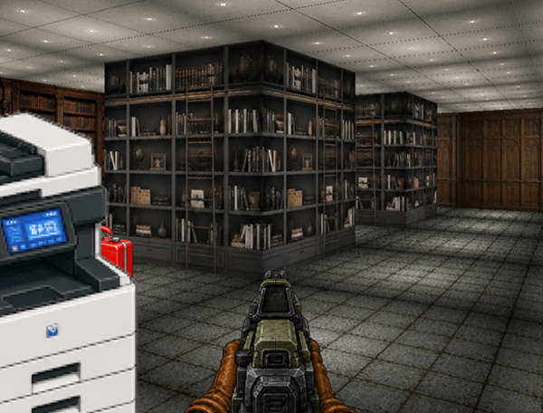
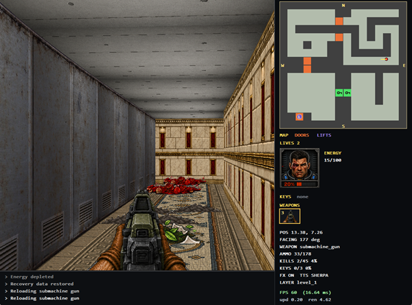
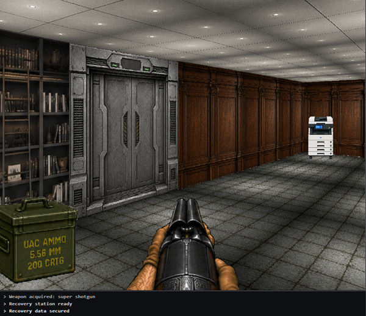

# nuRCADE

<p align="center"></p>

**nuRCADE** stands for **New (nu) Raycasting Classic Arcade Development Engine**.

The project was originally published as **WinRayCast**; that name is retained
only when discussing its history. Current code, tools, packages, and file
formats use the nuRCADE identity.

Welcome to nuRCADE, a modern refactoring of a classic 1990s ray-casting 3D engine, now revitalized for contemporary compilers. Crafted in C++, this project operates natively on Windows, eschewing reliance on external 3D libraries such as OpenGL or DirectX. At its core, nuRCADE is an homage to the foundational era of 3D gaming and graphical computation, demonstrating the ray-casting algorithm in its purest form.

## Project Background

This endeavor is more than a simple codebase; it's a deep dive into the roots of 3D rendering techniques. nuRCADE stands as a testament to the power and versatility of ray-casting in generating 3D environments. The project is directly inspired by and associated with an article originally published in the Computer Programming magazine by Infomedia ("Ray casting, engine 3d e videogame" by A. Calderone, first
published in Computer Programming, issue number 157 in May 2006.). You can delve into the article that started it all [here](https://drive.google.com/file/d/1VdE1RofILJtZBS246gOk02VrHA-Tu_79/view).

What started as a single-frame rendering demo has grown into a small but complete first-person playable demo: the renderer is still the same column-by-column ray caster, but it now sits under a gameplay layer with weapons, enemies, pickups, doors, sound, and a HUD.

## Features

- **Ray-cast renderer** — column-by-column wall casting, per-pixel floor/ceiling projection, depth shading, a scrolling sky/horizon layer, color-key transparency, and variable-height wall *spans*.
- **JSON world format** (`nurcade.world`, version 2) — a reusable *block palette* with per-block floor/ceiling surfaces and ordered wall spans, referenced by a cell matrix. Multiple **layers** (levels) can live in one world file.
- **Sprites** — Doom-style eight-direction billboards with multi-frame animation clips (idle / walk / attack / death) and per-distance LOD (mip-map) selection.
- **Actor AI** — sprites can patrol, detect, chase, return home, and attack; enemies have health, melee or ranged (burst-fire) attacks, and death animations. Weapon fire makes *noise* that temporarily widens nearby enemies' alert radius.
- **Weapons** — first-person view weapons (pistol, super shotgun, automatic submachine gun) with magazines, reserve ammo, reloads, automatic/semi-auto fire, weapon bob, and per-weapon range/damage. Switch weapons with the number keys.
- **Pickups** — medikits (health), ammo boxes, key cards (open locked doors), and a computer that unlocks the minimap, plus decorative props.
- **Interactive doors** — door blocks open on approach (optionally gated by a required key), animate through texture frames, play a sound, and auto-close.
- **HUD** — an unlockable minimap with a player marker and compass heading, a player status panel (health / weapon / ammo), and a bottom *teletype* event log for pickups and events.
- **Audio** — looping background music (Ogg/Vorbis) and sound effects for weapons, doors, and pickups.
- **WPF editor** — a .NET 8 authoring tool that shares the on-disk schema (see [Editor and unified solution](#editor-and-unified-solution)).

## Controls

| Key | Action |
|-----|--------|
| `↑` / `↓` | Move forward / backward |
| `←` / `→` | Turn left / right (accelerating) |
| `Shift` (held) | Run; `Shift`+`←`/`→` strafes instead of turning |
| `PgUp` / `PgDn` | Look up / down (horizon slope) |
| `Home` / `End` | Shift the projection center (look far up / down) |
| `1`–`9` | Select weapon by slot |
| `Space` / Left mouse | Fire the active weapon |
| `R` | Reload |
| `F7` | Toggle immortality |
| `F8` | Toggle sound effects |
| `F9` | Toggle background music |
| `F10` / `F11` | Background music volume down / up |
| `Esc` / `F12` | Quit |

## nuRCADE in Action: Screenshots

These screenshots show the current demo world, weapons, HUD, minimap/key status, sprites, wall spans, floor/ceiling projection, and open-sky areas.











## Dive into the Code

Interested in how classic 3D rendering works at the code level? nuRCADE is an open invitation to developers, enthusiasts, and students alike to explore the internals of a ray-casting engine. Whether you're a seasoned programmer looking to reminisce or a new developer eager to understand the building blocks of 3D graphics, nuRCADE offers an interesting educational experience.

### Making the engine

A long-form companion to the original *Ray Casting in 3D Game Engines* article — covering the renderer, the JSON world format, multi-frame sprite animations, the actor-system AI, the editor, and the packaging pipeline, with explanatory diagrams — lives in [docs/engine-making/](docs/engine-making/README.md). Figures are under [docs/engine-making/figures/](docs/engine-making/figures/).

## Building with CMake

nuRCADE uses CMake as the source of truth for Visual Studio projects. The generated solution and project files are intentionally not committed; create them locally under `out/`.

The CMake project builds three main targets:

- `nuRCADEEngine`: static library with the reusable ray-casting engine core.
- `nuRCADEWinSupport`: Windows helper library for DirectDraw presentation and bitmap-to-texture loading.
- `nuRCADEPlayer`: Windows FPS player executable that loads and runs nuRCADE worlds.

### Requirements

- Windows
- CMake 3.20 or newer
- Visual Studio with the Desktop development with C++ workload
- Windows SDK

### Generate Visual Studio Project Files

From a Developer PowerShell or any shell where CMake can find Visual Studio:

```powershell
cd C:\repo\nurcade
cmake --preset vs2026-x64
```

This creates the generated Visual Studio files in:

```text
C:\repo\nurcade\out\build\vs2026-x64
```

With CMake 4 and Visual Studio 2026 the generated solution file may use the new `.slnx` format:

```text
out\build\vs2026-x64\nuRCADE.slnx
```

### Build Debug and Release

```powershell
cmake --build --preset vs2026-x64-debug
cmake --build --preset vs2026-x64-release
```

The executables are generated here:

```text
out\build\vs2026-x64\Debug\nuRCADEPlayer.exe
out\build\vs2026-x64\Release\nuRCADEPlayer.exe
```

The engine library is generated here:

```text
out\build\vs2026-x64\Debug\nuRCADEEngine.lib
out\build\vs2026-x64\Release\nuRCADEEngine.lib
```

The Windows support helper library is generated here:

```text
out\build\vs2026-x64\Debug\nuRCADEWinSupport.lib
out\build\vs2026-x64\Release\nuRCADEWinSupport.lib
```

Run the executable from the repository root so it can find the self-contained demo world package:

```powershell
cd C:\repo\nurcade
.\out\build\vs2026-x64\Release\nuRCADEPlayer.exe
```

You can also pass a world package directly:

```powershell
.\out\build\vs2026-x64\Release\nuRCADEPlayer.exe .\res\worlds\demo_embedded\demo.world.json
```

### Optional neural text-to-speech

nuRCADE uses `sherpa-onnx` neural TTS for spoken event messages. Sound effects and background music still use the Windows audio stack. On x64, CMake downloads the official shared SDK and the deep male Piper `en_GB-alan-medium-int8` voice when no local installation is found, then places the DLLs and model beside the player. Downloads are cached inside the build directory. A local installation can still be provided through the `sherpa-onnx` pkg-config package or `SHERPA_ONNX_ROOT`.

The bundled build needs no environment variables. These optional overrides select another compatible model:

```powershell
$env:NURCADE_TTS_MODEL = 'C:\tts\voice\model.onnx'
$env:NURCADE_TTS_TOKENS = 'C:\tts\voice\tokens.txt'
$env:NURCADE_TTS_DATA_DIR = 'C:\tts\voice\espeak-ng-data'
```

Models using a lexicon can set `NURCADE_TTS_LEXICON` instead of `NURCADE_TTS_DATA_DIR`. To force the native Windows backend at build time:

```powershell
cmake --preset vs2026-x64 -DNURCADE_ENABLE_NEURAL_TTS=OFF
```

Use `nuRCADEPlayer.exe --tts-test` to speak a startup test phrase. After the first spoken event, the HUD reports `TTS SHERPA` or `TTS SAPI`, reflecting the backend that actually succeeded. If the player falls back to SAPI, it also emits a debug diagnostic explaining which sherpa asset or initialization step failed.

Sherpa-onnx also publishes static Windows libraries, so static linking is possible, but the default nuRCADE package currently uses the official shared SDK and bundles the required DLLs beside `nuRCADEPlayer.exe`.

Developer controls are hidden during normal play. Start the player with
`nuRCADEPlayer.exe --dev` to expose the **Game** cheat menu and the dynamic
**Level** menu. Options such as `--immortal` take effect only together with
`--dev`.

### Other Presets

Available presets can be listed with:

```powershell
cmake --list-presets
```

Current presets include Visual Studio 2026 and Visual Studio 2022, each with x64 and Win32 variants:

```text
vs2026-x64
vs2026-win32
vs2022-x64
vs2022-win32
```

## Editor and unified solution

The C# WPF editor (`tools/NuRcade.Editor`) is **part of the same generated Visual Studio solution** as the engine. The CMake build adds the editor projects via `include_external_msproject`, so opening `out\build\vs2026-x64\nuRCADE.slnx` shows:

- `Engine/` — `nuRCADEPlayer`, `nuRCADEEngine`, `nuRCADEWinSupport`, `nuRCADETests`
- `Editor/` — `NuRcade.Editor.Core`, `NuRcade.Editor`, `NuRcade.Editor.Tests`
- `PACKAGE` (top-level) — builds the installer via CPack

Building the solution from Visual Studio (or `cmake --build`) compiles the engine in C++ and the editor in .NET 8 in one shot, and also runs `dotnet publish` for the editor into `<build>/editor_publish/` as a self-contained Win-x64 single-file `.exe`.

### Requirements for the editor

- .NET 8 SDK in `PATH` (`dotnet --version`).

## Packaging the installer

`include(CPack)` registers a `PACKAGE` target / `cpack` command that produces a redistributable bundle containing:

- `nuRCADEPlayer.exe`
- `res/worlds/demo_embedded/` (the self-contained world package: map/layer JSON, wall and sky textures, sprite metadata and bitmaps, weapon definitions, sound effects, background music, and HUD frames)
- `res/examples/` (legacy/test fixtures kept separate from runnable world packages)
- `editor/NuRcade.Editor.exe` (self-contained, no .NET runtime required on the target machine)
- `LICENSE.txt`

The two configured generators are `NSIS` (Windows installer `.exe`) and `ZIP` (portable archive).

### Requirements for the installer

- .NET 8 SDK on the build machine.
- [NSIS](https://nsis.sourceforge.io) on the build machine (only for the `.exe` installer — the ZIP works without it).

### Build the installer

From the repository root:

```powershell
cmake --preset vs2026-x64
cmake --build --preset vs2026-x64-package
```

The package preset builds the same top-level `PACKAGE` project that appears in
the generated Visual Studio solution. If you prefer to call CPack directly, run:

```powershell
cmake --build --preset vs2026-x64-release
cpack --config out\build\vs2026-x64\CPackConfig.cmake -C Release
```

Equivalently, in Visual Studio: build the `PACKAGE` project under the top-level CMake folder. The resulting artifacts land next to the solution:

```text
out\build\vs2026-x64\nuRCADE-1.2.0-win-x64-setup.exe
out\build\vs2026-x64\nuRCADE-1.2.0-win-x64-setup.zip
```

The NSIS installer registers an uninstaller and three Start-menu shortcuts: **nuRCADE Player**, **nuRCADE Player (demo world)**, and **nuRCADE Editor**.
