# Making the WinRaycast 3D Engine

> Companion technical document to the article *Ray Casting in 3D Game Engines* (A. Calderone, *Computer Programming* #157, Infomedia, May 2006; English revision 2023). The article describes the foundational algorithm; this document mirrors its structure and extends it to cover every feature the project has accumulated since: a multi-layer JSON world format, multi-frame directional sprite animations, an actor-system AI with combat, first-person weapons, interactive doors, a minimap/compass/event-log HUD, audio, a WPF authoring tool with an animation playback canvas, and a CMake/CPack distribution pipeline.

---

## Table of contents

- [Abstract](#abstract)
- [Index terms](#index-terms)
- [I. Introduction](#i-introduction)
- [II. Introduction to ray tracing](#ii-introduction-to-ray-tracing)
- [III. Ray casting](#iii-ray-casting)
- [IV. The implementation](#iv-the-implementation)
  - [IV.1 The ray-angle space](#iv1-the-ray-angle-space)
  - [IV.2 First horizontal and vertical intersections](#iv2-first-horizontal-and-vertical-intersections)
  - [IV.3 Stepping to the next intersection](#iv3-stepping-to-the-next-intersection)
  - [IV.4 What counts as a solid hit](#iv4-what-counts-as-a-solid-hit)
  - [IV.5 Fish-eye correction](#iv5-fish-eye-correction)
  - [IV.6 Projection: distance to wall-slice height](#iv6-projection-distance-to-wall-slice-height)
  - [IV.7 Look up and look down](#iv7-look-up-and-look-down)
- [V. Texture mapping and shading](#v-texture-mapping-and-shading)
- [VI. Rendering of ceiling and floor](#vi-rendering-of-ceiling-and-floor)
- [VII. Transparency, animated effects, sprites, and mip mapping](#vii-transparency-animated-effects-sprites-and-mip-mapping)
- [VIII. The JSON world format](#viii-the-json-world-format)
- [IX. Multi-frame sprite animations](#ix-multi-frame-sprite-animations)
- [X. Actor system, AI, and combat](#x-actor-system-ai-and-combat)
- [XI. The gameplay layer: weapons, doors, HUD, and audio](#xi-the-gameplay-layer-weapons-doors-hud-and-audio)
  - [XI.1 First-person weapons](#xi1-first-person-weapons)
  - [XI.2 Doors and keys](#xi2-doors-and-keys)
  - [XI.3 The HUD: minimap, compass, and event log](#xi3-the-hud-minimap-compass-and-event-log)
  - [XI.4 Audio](#xi4-audio)
  - [XI.5 Multi-layer worlds](#xi5-multi-layer-worlds)
- [XII. The editor](#xii-the-editor)
- [XIII. Build, packaging, and distribution](#xiii-build-packaging-and-distribution)
- [XIV. Testing](#xiv-testing)
- [XV. Conclusion](#xv-conclusion)
- [References](#references)
- [About the author](#about-the-author)

---

## Abstract

This document is the long-form technical note that accompanies the original *Ray Casting in 3D Game Engines* article. It is written so that two kinds of reader can follow it side by side: someone curious about how early-1990s first-person games produced 3D images on machines without GPUs, and someone who actually wants to read, modify, or extend the source code in this repository. Each section starts from intuition, then drills down into the file and line where the corresponding code lives today.

The structure follows the article's Roman-numeral ordering (I – VII) for the core renderer, and then extends it with new sections covering the features the codebase has accumulated since 2006: the JSON world format, multi-frame directional sprite animations, the actor-system AI, the gameplay layer (weapons, combat, doors, HUD, and audio), the WPF editor, the CMake/CPack distribution pipeline, and the automated test layout. Figures are included as SVG diagrams under [`figures/`](figures/) and referenced inline.

## Index terms

Ray casting, 3D rendering, video game engines, texture mapping, transparency, animated effects, sprites, mip mapping, WinRaycast, recursive algorithms, computer graphics, multi-frame animation, actor AI, JSON world format, world editor, CPack packaging.

## I. Introduction

Graphics engines based on the ray-casting algorithm were once highly popular. *Wolfenstein 3D* (id Software, 1992) showed they could run smoothly on Intel 286-class hardware; *Doom* (1993) refined the same family with sprites, transparent walls, and variable-height sectors. Modern GPUs eventually made polygon pipelines the default, but the ray-casting model never quite lost its appeal: every step is observable in a debugger, the math fits on a whiteboard, and the cost is dominated by per-column work rather than per-triangle work — properties that suit embedded screens, educational settings, and retro-flavored games equally well.

WinRaycast began life as the demo accompanying the 2006 article and is now a small but real C++ engine plus a playable first-person demo and tooling. The 2006 source already ran the column-by-column renderer, the floor/ceiling pass, BMP texture mapping with depth shading, an animated horizon, color-key transparency, and one billboard sprite. The current tree keeps every one of those pieces and adds:

- a JSON [world format](../../src/engine/WorldJsonLoader.h) where each cell references a named *block definition* with multiple wall spans, per-cell floor/ceiling textures, collision flags, and an optional horizon image — and where a single world file can hold several **layers** (levels);
- multi-frame, eight-direction [sprite animations](../../src/engine/Sprite.h) with idle/walk/attack/death clips and a per-distance LOD selector;
- an [actor system](../../src/engine/ActorSystem.h) that drives sprites through Idle → Patrolling → Chasing → Returning → Attacking states with detection radius, patrol radius, engagement hysteresis, and stopping distance, plus enemy health, melee/ranged burst attacks, and a weapon-noise alert mechanic;
- first-person [weapons](../../src/engine/ViewWeapon.h) with magazines, reserve ammo, reloads, automatic/semi-auto fire, weapon bob, and per-weapon range and damage;
- interactive [door blocks](../../src/engine/WorldBlock.h) that open on approach (optionally gated by a key), animate through texture frames, play a sound, and auto-close;
- a software-rendered HUD — an unlockable minimap with player marker and compass, a player status panel, and a bottom *teletype* event log;
- [audio](../../src/win/BackgroundMusicPlayer.h): looping Ogg/Vorbis background music and sound effects for weapons, doors, and pickups;
- a Windows WPF [editor](../../tools/WinRaycastEditor/) sharing only the on-disk schema with the engine, complete with sprite and weapon animation playback transport (play / pause / stop / step ±1), an inline JSON editor, texture import, inline sprite rename, and drag-and-drop sprite/player placement;
- a CMake + CPack pipeline that builds the engine, publishes the editor as a self-contained single-file executable, and assembles an NSIS installer plus a portable ZIP.

The guiding constraint has not changed: the renderer should remain small enough to read in an afternoon, while the data model becomes rich enough to describe a small world rather than a numeric maze. Whenever a new feature threatened either property, the design was reconsidered before merging.

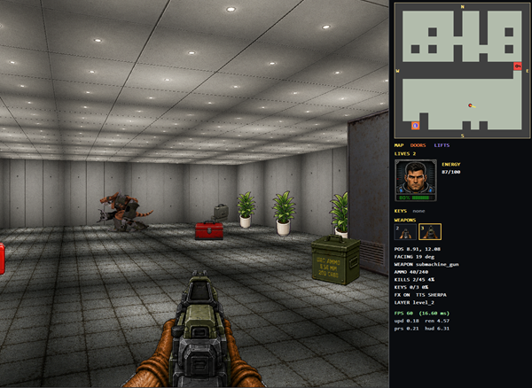

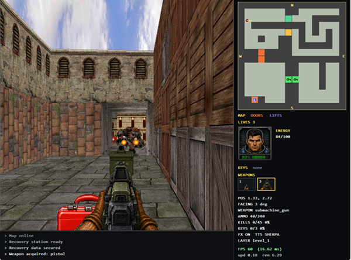

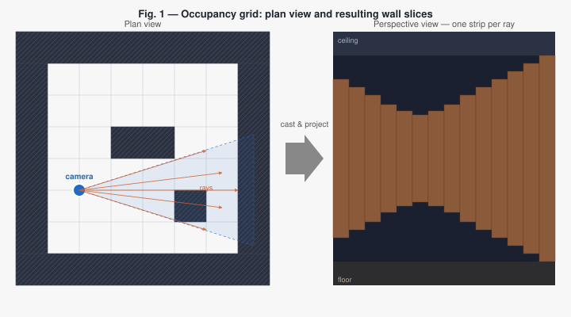

## II. Introduction to ray tracing

Ray tracing is a photorealistic rendering technique. Starting from a description of objects in 3D space, it computes — for each pixel of the projection plane — the path of light from a light source to that pixel, reflecting and refracting off scene materials. The version actually implemented in renderers is *backward* ray tracing: rays start from the camera (one per pixel) and are traced back to whatever surface they meet. Because the only rays that matter are those that reach the observer, this saves an enormous amount of work compared to forward simulation.

The trade-off is still steep. A scene with millions of pixels and a few light bounces needs hundreds of millions of intersection tests, each potentially recursive. Even with modern hardware, real-time ray tracing for full scenes only became feasible with dedicated GPU acceleration. For 1992-class hardware — and for many embedded targets today — ray tracing is not a real-time option.

## III. Ray casting

Ray casting is the simplified cousin that real-time engines actually use. It keeps the *cast one ray per screen column* idea, but it replaces the arbitrary 3D world with an **occupancy grid**: the world is a 2D matrix where each cell either is "empty" (the player can stand there) or holds a "block" with one or more wall surfaces. The camera moves on this 2D plane, constrained to the empty cells, and a field of view fans out a finite number of rays — one per screen column — across an angle of roughly 60°.

For each ray, the algorithm walks the grid until it hits an occupied block, measures the distance, and projects a vertical *wall slice* whose pixel height is inversely proportional to that distance. Iterating across the FOV produces a perspective-correct view of the scene without any matrix transforms, polygon clipping, or z-buffer. Figure 1 above contrasts the plan view (a 2D radial spray of rays out of the camera) with the resulting perspective view (a 3D corridor where strip heights encode depth).

The price is the constraint: walls live on the grid, floors and ceilings are flat planes, and free-form geometry is out of the picture. WinRaycast accepts the constraint and then pushes against it — variable-height wall *spans*, transparent walls, portal-like blocks, animated horizon, billboard sprites, and now actor AI all extend what a grid cell can describe while preserving the column-by-column rendering core.

### Why two coordinate systems

There are two coordinate systems involved at this level, and almost every subtle rendering bug eventually traces back to confusing them:

- **World units.** The world is a 2D grid of cells. Each cell has a width `cellDx` and a height `cellDy` measured in *world units* (the default is `512 × 512` in [`WorldMap.h`](../../src/engine/WorldMap.h), with the original engine using `256 × 256`). Ray intersections, sprite positions, distance computations — everything runtime — works in world units.
- **Cell units.** Humans and editors prefer talking about cell `(5, 7)` instead of world `(2560, 3584)`. The world JSON expresses positions like the player start in cell coordinates; the engine multiplies by `cellDx` and `cellDy` on load.

The conversion is trivial: `world_x = cell_x · cellDx`. The player carries its position in world units (`m_x`, `m_y` in [`Player.h`](../../src/engine/Player.h)) but the player start is authored as `{ "xCell": 4.5, "yCell": 4.5 }` and the editor exposes everything in cells. Fractional cell coordinates matter: when the player sits exactly on a grid boundary, `castSolidWallRay` can hit degenerate cases where a wall is missed or two adjacent cells claim the same hit. Starting at a half-cell keeps the camera safely inside one cell for the first frame.

The output frame buffer uses ordinary pixel coordinates with `(0, 0)` in the top-left corner. The `Player` class also tracks a *projection resolution* (`xProjRes × yProjRes`) which is the logical resolution at which the engine pretends to render; this is what drives the per-column main loop. A *horizon line* sits at roughly `yProjRes / 2`, offset by `Player::getSlope()` to simulate looking up or down (see § IV.7) without any actual pitch rotation.

## IV. The implementation

A "2.5D" engine does not need 3D matrix transforms; it needs plane geometry, a lot of precomputed trigonometry, and a tight loop over screen columns. The implementation lives in two files: the geometry happens in [`src/engine/RayCaster.cpp`](../../src/engine/RayCaster.cpp), and the per-frame assembly happens in [`src/engine/RaycastEngine.cpp`](../../src/engine/RaycastEngine.cpp).

The end-to-end data flow inside one frame is summarised in Figure 2.

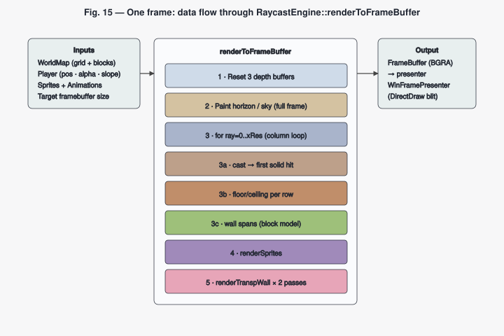

### IV.1 The ray-angle space

The first design choice that distinguishes a ray caster from a polygon renderer is that *angles are not radians at runtime*. The [`Player`](../../src/engine/Player.h) constructor allocates lookup tables sized so that one screen column corresponds to exactly one angular index, as illustrated in Figure 3.

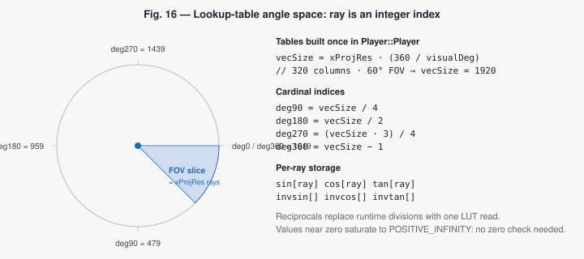

The table size is

```text
vecSize = xProjRes * (360 / visualDeg)
```

so with a typical projection resolution of 320 columns and a 60° field of view, `vecSize = 1920`. Cardinal angles are integer indices into that table:

```text
deg90  = vecSize / 4
deg180 = vecSize / 2
deg270 = (vecSize * 3) / 4
deg360 = vecSize - 1
```

The constructor fills six tables — `sin`, `cos`, `tan` and their reciprocals — at [`Player.cpp:129-148`](../../src/engine/Player.cpp#L129-L148):

```cpp
for (int ray = 0; ray < vecSize; ++ray) {
    const double alpha =
        (double(ray * 360.0) / double(m_deg360)) * (3.14159265359 / 180.0);

    m_cosTbl[ray] = ::cos(alpha);
    m_sinTbl[ray] = ::sin(alpha);
    m_tanTbl[ray] = ::tan(alpha);

    m_invCosTbl[ray] = fabs(m_cosTbl[ray]) <= SMALLEST_EPSILON
        ? sign(m_cosTbl[ray]) * POSITIVE_INFINITY
        : 1.0 / m_cosTbl[ray];
    // …same pattern for invSin, invTan
}
```

Two design points worth keeping in mind:

1. **Reciprocals are stored, not computed.** The per-ray intersection formulas (§ IV.2 below) multiply by `invcos(ray)` or `invsin(ray)` rather than dividing. That kills one division per ray per intersection candidate. On a modern CPU this is no longer the dramatic win it was on a 286, but it keeps the math symmetric and removes the special case where a denominator approaches zero.
2. **Near-zero values saturate to infinity.** The renderer never has to test the denominator before using it: a divisor that would have been zero now multiplies by a saturated `POSITIVE_INFINITY` value, producing a distance comparison that the rest of the algorithm naturally rejects.

A direct consequence: a *ray* is just an integer index. Iterating `for (int ray = 0; ray < xProjRes; ++ray)` walks screen columns and view angles in lockstep, and `distortDeg = ray - degHalfVisual()` is already in the same lookup-table units — no degree-to-radian conversion is ever needed inside the inner loop.

### IV.2 First horizontal and vertical intersections

A ray cast from the camera through the grid crosses two families of lines: vertical lines `x = k · cellDx` and horizontal lines `y = k · cellDy`. Figure 4 shows both families along a single ray.

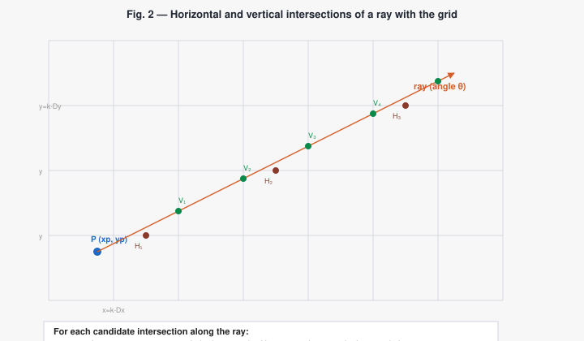

The algorithm tracks the next intersection from each family and advances whichever is closer. The first one is the only computation that needs the camera's position; subsequent ones are constant increments.

The first vertical intersection is computed at [`RayCaster.cpp:36-53`](../../src/engine/RayCaster.cpp#L36-L53):

```cpp
void RayCaster::firstVerticalIntersection(
    const WorldMap& map,
    int ray,
    const double& slope,
    Point2d& point) const noexcept
{
    const double xp = m_player.getX();
    const double yp = m_player.getY();

    const double xi = ray >= m_player.deg90() && ray < m_player.deg270()
        ? static_cast<double>(map.getPlayerCellPos().first) * map.getCellDx()
        : static_cast<double>(map.getPlayerCellPos().first + 1) * map.getCellDx();

    const double yc = slope * (xi - xp) + yp;
    point.first  = xi;
    point.second = yc;
}
```

If the ray points roughly leftward (`deg90 ≤ ray < deg270`), the first vertical line it crosses is the *left* edge of the current cell; otherwise it is the *right* edge. From `xi` and the equation of the line through the camera with slope `tan(ray)`, the `y` coordinate follows. The dual `firstHorizontalIntersection` mirrors this idea for the other axis using `inverseSlope = 1 / tan(ray)`.

### IV.3 Stepping to the next intersection

Once the first intersection of each family is known, advancing one cell is a constant operation:

```cpp
nextVertical.first  = previous.first  + cellDx;            // or − cellDx when heading west
nextVertical.second = previous.second + slope * cellDx;
```

The horizontal version uses `cellDy` and `invtan(ray)`. The sign of both increments flips based on the same heading test used for the first intersection.

The caster then enters a tight loop:

1. Pick the family whose next intersection is closer (using `(intersection − cameraPos) * invcos|invsin(ray)` for distance — no square root, no division).
2. Sample the cell on the *far* side of the line just crossed: when the ray is heading west, the cell that owns a vertical hit lives one column to the left of the line, not on it. The `--col` / `--row` adjustments at the top of `verticalWall` / `horizontalWall` (and the matching `verticalBlock` / `horizontalBlock`) handle that.
3. If it is a solid hit (see § IV.4), return the `RayHit`.
4. Otherwise step the chosen family's intersection by one cell and repeat.

This is grid traversal at O(grid extent) rather than O(world size) — the property that lets a ray caster run on a 286.

### IV.4 What counts as a "solid hit"

This is one of the few places where the legacy packed-cell model and the new block model meet. The `isSolidHit` helper near the top of [`RayCaster.cpp`](../../src/engine/RayCaster.cpp) reads:

```cpp
if (MapCell::hasAnyWall(cell)) {
    return MapCell::hasSolidWall(cell);
}
return block != nullptr && block->hasAnySolidSpan;
```

If the cell uses the old packed model and has any wall texture set, a hit counts as solid only if its low byte (the solid-wall texture key) is non-zero. If the cell is part of a `BlockDefinition` from the JSON loader, a hit counts as solid only if at least one of its wall spans is marked `Solid`. This rule is what lets the same ray caster serve both formats while still producing the right occlusion for transparent or portal-like blocks: transparent spans are skipped here and picked up later by a dedicated pass (§ VII).

### IV.5 Fish-eye correction

The raw distance returned by `castSolidWallRay` is the distance from the camera *along the ray*. Projecting a wall slice with height proportional to `1 / rawDistance` would bulge the image into the classic fish-eye artifact, because a ray angled away from the view direction travels farther to reach a wall that is, perceptually, the same depth. Figure 5 contrasts the two cases.

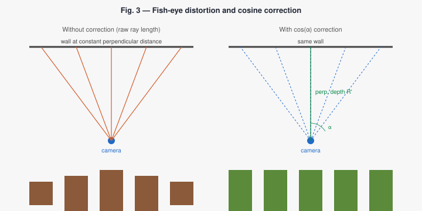

The fix in `RaycastEngine::renderToFrameBuffer` converts the along-ray distance into the perpendicular distance to the view plane:

```cpp
const int distortDeg = ray - m_player.degHalfVisual();
const double viewDistortLut = m_player.cos(distortDeg);
const double correctedDepth = renderDistance * viewDistortLut;
```

`distortDeg = 0` at the centre column, growing in magnitude towards the edges. Multiplying by `cos(distortDeg)` projects the ray onto the view-centre axis — the operation that recovers the perpendicular depth. Note that `viewDistortLut` is one LUT read, not a runtime cosine evaluation.

### IV.6 Projection: distance to wall-slice height

Once `correctedDepth` is known, the projected pixel height of a unit-tall wall slice at this distance is one divide:

```cpp
const double scaledDistortLut = m_scale / viewDistortLut;
k = int(scaledDistortLut / renderDistance);
```

`m_scale` is the scaling factor chosen so that the projection has the right vertical field of view for the requested viewport, the same constant the article calls the *scaling factor*. Near walls get tall `k`; far walls get short `k`. The renderer then places the wall slice between `horizonY + centerProj − ⌊k · spanTop / cellDy⌋` and `horizonY + centerProj − ⌊k · spanBottom / cellDy⌋`, and `shadingStretchBtl` (§ V) walks the texture between those two screen-space rows.

In conceptual one-liner form:

```text
projected_height = projection_scale / corrected_distance
```

A polygon renderer would arrive at the same effect through a 4×4 perspective matrix; a ray caster gets there with one divide.

### IV.7 Look up and look down

A nice property of the model is that *looking up or down* does not require a true pitch rotation. The renderer treats the centre of projection as a variable row (`m_projCenter`, exposed via `Player::setCenterProj`) and a per-frame slope offset (`Player::getSlope()`). Moving these two values shifts the horizon line up or down on screen, producing the same visual effect as a small pitch, as illustrated in Figure 6.

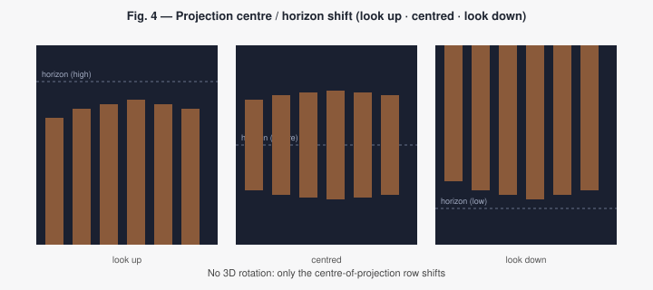

The article's Figure 5 captures the same idea: the same scene, the same camera position, just a different `slope`. Conceptually, the centre of projection is the row where rays at horizontal angle 0 land; moving it up or down redistributes the wall/floor/ceiling areas without touching the cast or texture logic.

## V. Texture mapping and shading

Texture mapping in WinRaycast is per-block. Each cell stores up to five texture keys (solid wall, ceiling, floor, transparent wall, upper wall) packed into a 64-bit value, plus an optional reference to a `BlockDefinition` for the JSON model. The two-hex-digit *texture key* in the world JSON maps to a file name; the loader strips the `.bmp`/`.png` extension so the on-disk encoding is independent of the bitmap format.

Texture keys in the legacy packed cell are laid out byte by byte:

| Byte (LSB → MSB) | Field                    | Mask                  | `MapCell` accessor              |
|------------------|--------------------------|-----------------------|---------------------------------|
| 0                | solid wall texture       | `0x00000000000000ff`  | `solidWallTexture(cell)`        |
| 1                | ceiling texture          | `0x000000000000ff00`  | `ceilingTexture(cell)`          |
| 2                | floor texture            | `0x0000000000ff0000`  | `floorTexture(cell)`            |
| 3                | transparent wall texture | `0x00000000ff000000`  | `transparentWallTexture(cell)`  |
| 4                | upper wall texture       | `0x000000ff00000000`  | `upperWallTexture(cell)`        |

A value of `0` in any field means "no texture of that kind". The reserved key `0xff` (`TRANSPARENT_TEXTURE_KEY`) means "the void" — `WorldMap` uses this slot to store the sky/horizon texture, and `MapCell::isTransparentTexture` lets the renderer skip drawing wherever the cell explicitly opens to the sky.

For each pixel of a wall slice, the renderer determines (i) which texture key the cell holds for the surface in question, (ii) which texel of that texture corresponds to the projected screen pixel, and (iii) how much to darken the texel by distance. The pipeline is implemented in `RaycastEngine::shadingStretchBtl`, declared at [`RaycastEngine.h:242-249`](../../src/engine/RaycastEngine.h#L242-L249):

```cpp
void shadingStretchBtl(
    int xDest, int yDest,
    int heightDest,
    int xSrc, int ySrc,
    int height_source, int widthSrc,
    int maxVisibleY, double depthPar, const Texture* texture,
    double wallDepth);
```

The ratio `step = heightSource / heightDest` is the vertical stride through the source texture per destination pixel. For each output pixel the renderer reads the source colour, then either writes it straight to the framebuffer (if `depthPar ≥ 1`) or attenuates each RGB component by `depthPar` before writing:

```cpp
const auto color  = texture->getPixel(xSrc, int(ys) % heightSource);
if (depthPar < 1.0) {
    drawPixel32(xDest, yd, makeColor(
        uint8_t(depthPar * colorRed(color)),
        uint8_t(depthPar * colorGreen(color)),
        uint8_t(depthPar * colorBlue(color))));
} else {
    drawPixel32(xDest, yd, color);
}
```

`depthPar` decreases as `wallDepth` grows — distant walls become darker without any explicit lighting pass. Figure 7 shows the effect: a corridor where the side walls fade smoothly to near-black at the horizon and the bright nearer portions still preserve full hue.

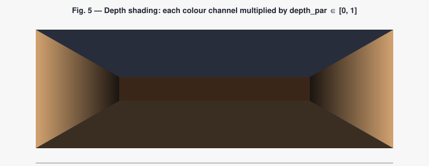

Transparent textures use a parallel routine, `transpShadingStretchBtl` at [`RaycastEngine.h:251-259`](../../src/engine/RaycastEngine.h#L251-L259), which adds an early-out for texels whose RGB matches the texture's transparent colour. This is the colour-key transparency used for transparent walls and for sprites — see § VII.

### Coexistence with PNG

The loader accepts both `.bmp` and `.png`. The default still-life textures in the original demo are 256-colour BMPs; newer sprite sets (the `small_imp`, `floating_demon_head`, and `sheet_brute` packages) use 32-bit PNG with the magenta or black colour key called out in the metadata. The Windows-side `WinTextureLoader` resolves the extension automatically and produces a `Texture` object whose pixel format is normalised before the engine ever touches it.

## VI. Rendering of ceiling and floor

Floors and ceilings could be ray-cast in their own right, but a per-pixel inverse projection is much cheaper and fits the column loop naturally. The renderer walks the rows immediately below and above the wall slice for each column, and for each row it computes:

1. The distance from the camera to the floor (or ceiling) plane point that projects to this screen pixel.
2. The world `(x, y)` coordinate along the current ray at that distance.
3. The cell containing that point.
4. The cell's floor or ceiling texture key.
5. The texel sampled by the world coordinate modulo `cellDx × cellDy`.
6. The distance-shading factor.

Translated to code, the floor pass in [`RaycastEngine.cpp`](../../src/engine/RaycastEngine.cpp) reads (paraphrased and shortened):

```cpp
for (int floorRay = m_player.getSlope();
     floorRay < (ceilBottom + centerOfProjection);
     ++floorRay) {

    const double deltaC = ceilBottom - floorRay;
    if (deltaC <= 0.0) continue;

    const double distanceToFloor = floorScaledDistortLut / deltaC;

    const int xPicture = int(m_player.cos(relRay) * distanceToFloor) + cameraPosX;
    const int yPicture = int(m_player.sin(relRay) * distanceToFloor) + cameraPosY;

    const int row = yPicture / cellDy;
    const int col = xPicture / cellDx;
    if (row < 0 || row >= map.rowCount() || col < 0 || col >= map.colCount())
        continue;

    const int floorKey = MapCell::floorTexture(map[row][col]);
    if (floorKey == 0 || floorKey == MapCell::TRANSPARENT_TEXTURE_KEY) continue;

    const auto* tex = map.texture(floorKey);
    const Color c = tex->getPixel(xPicture % cellDx, yPicture % cellDy);

    const double shading = m_ceilFloorShadingPar / distanceToFloor;
    if (shading >= 1.0) {
        drawPixel32(ray, screenY, c);
    } else {
        drawPixel32(ray, screenY, makeColor(
            uint8_t(shading * colorRed(c)),
            uint8_t(shading * colorGreen(c)),
            uint8_t(shading * colorBlue(c))));
    }
}
```

The ceiling pass mirrors the floor pass with the rows above the horizon.

In the JSON block model, each cell can override its floor and ceiling individually — the [`BlockDefinition`](../../src/engine/WorldBlock.h) struct holds a `Surface` for each — so a corridor floor, a temple floor, and an open-sky cell can all coexist along the same row without any global state. Open-sky cells use the reserved `MapCell::TRANSPARENT_TEXTURE_KEY` for the ceiling: the ceiling pass simply skips drawing on those rows, and the previously-painted sky stays visible.

### Horizon and sky background

The sky is a *layer*, not geometry. Before any walls, floors, ceilings or sprites are drawn, the renderer fills the whole frame buffer with the horizon image when the world declares one. The image scrolls horizontally with the camera angle: if the camera rotates clockwise, the image scrolls left, and vice versa. Seamless images keep the illusion convincing. Subsequent rendering passes either overwrite the sky (opaque pixels) or leave it untouched (transparent pixels / open-sky cells), so the sky acts as the bottom of the painter's-algorithm stack — see Figure 8.

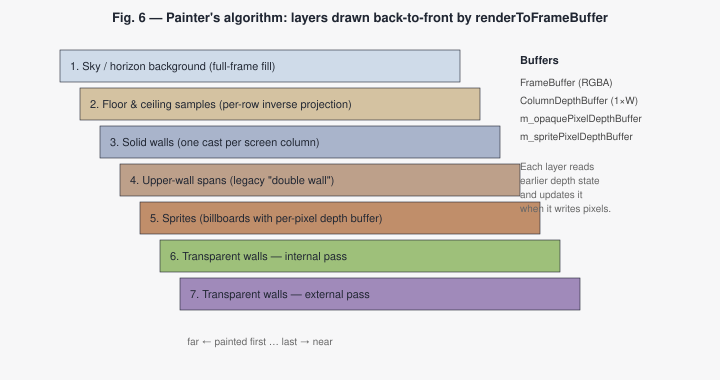

## VII. Transparency, animated effects, sprites, and mip mapping

The article observes that ray casting, like ray tracing, can be executed *recursively*: when a ray crosses a transparent surface the engine can continue past it, render the geometry behind, and then composite the transparent pixel on top. WinRaycast uses the painter's algorithm to achieve the same effect — distant surfaces first, then nearer ones — and combines it with per-pixel depth tests to keep the composition consistent in the presence of sprites and portal frames. Figure 8 above shows the seven layers that make up one frame.

### VII.1 Three depth representations

The renderer maintains three depth concepts at once:

- a [`ColumnDepthBuffer`](../../src/engine/ColumnDepthBuffer.h) — one distance per screen column, used for the classic wall/sprite occlusion;
- `m_opaquePixelDepthBuffer` — per pixel, recording the depth of the nearest opaque surface drawn so far;
- `m_spritePixelDepthBuffer` — per pixel, recording the depth of the nearest sprite pixel.

The three buffers exist because the interactions between sprites and transparent walls cannot be expressed with one depth per column. A transparent wall far behind a sprite must not overwrite the sprite, but a closer transparent pane must occlude a farther one. The two per-pixel buffers carry just enough information for the [`renderTranspWall`](../../src/engine/RaycastEngine.h) pass — invoked twice with `render_internal_wall = true` then `false` — to make the right decision pixel by pixel.

### VII.2 Transparent walls and portal blocks

A transparent wall is an ordinary wall span with `kind = "transparent"`. The classic ray caster steps right through it (the solid ray ignores transparent spans), so the wall does not stop the main column ray. A second pass collects up to a small fixed number of transparent hits along each ray, projects them, and composites their non-key-coloured pixels in back-to-front order. The original demo uses `textures/texture_original_03_transparent_wall.bmp` as the canonical transparent surface; the new block model lets a single cell mix a transparent lower span with a solid upper lintel (`05` in the demo world), producing window-and-portal geometry without ad-hoc code.

The visual transparency flag and the movement flag are intentionally separate.
`kind = "transparent"` only decides which render pass sees the span; `passable`
decides whether player and actor collision can cross it. A transparent span can
therefore be a blocking glass pane or grate, while a solid-looking span can be
used as a passable effect or future trigger volume. In the C++ runtime this is
stored as `WallSpan::kind` plus `WallSpan::collision`, and `WorldMap::isSolidAtWorld`
uses only the collision aggregate for movement queries.

Wall spans can also override their texture per side through `faceTextures`.
The keys are `north`, `east`, `south`, and `west`; missing entries fall back to
the span's default `texture`. `RayCaster::RayHit` carries the hit face, so the
renderer can sample a different bitmap when the camera sees the west side of a
block versus the east side. This keeps ordinary blocks compact while allowing
future elevator and door blocks to animate exactly one visible side.

This separation is also the foundation for doors. A door is a block with
runtime state, not a free sprite. In the demo world the lower span is a
transparent animated door panel and the upper span stays solid, matching the
existing portal/lintel block. The solid ray can continue through the lower
transparent span and render the geometry behind it; the transparent-wall pass
then composites the current door frame over the result. Movement collision is
driven by the door state: the block is solid while closed or opening, then
becomes passable once the opening animation reaches the configured threshold.
The texture frame is resolved from the same per-cell state, so the C++ runtime
and editor round-trip the same `door` metadata.

The door texture should reserve alpha for the actual aperture only. Pixels
outside the inner opening should remain opaque wall or frame material; otherwise
the player sees accidental holes around the door sprite instead of a believable
block face.

### VII.3 Animated effects

The original engine's fire and water effects worked by dynamically swapping the texture bitmap associated with a key. The same hook still exists in the current code: any [`Texture`](../../src/engine/Texture.h) bound to a key can be replaced between frames, and the next render picks up the new pixels automatically. This is the cheapest possible animation channel — useful for procedural effects (fire, water ripples, intermittent lights) that do not need per-frame timing or LOD.

### VII.4 Sprites

Sprites are billboards: they always project as if they were facing the camera, but the *image* drawn can depend on the angle between the camera and the sprite's own facing — the Doom-style eight-direction trick. Figure 9 shows how the eight directional views are organised around the sprite's facing vector and how `selectViewIndex` picks one of them based on the angle to the camera.

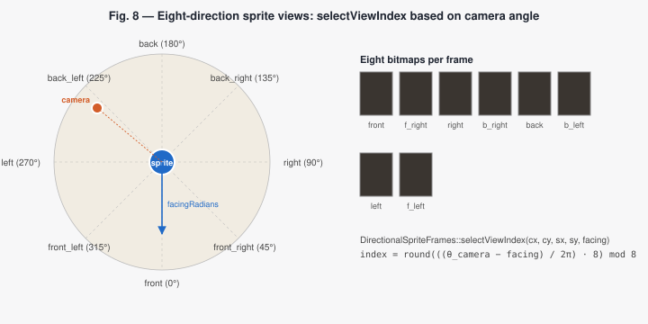

Each sprite is described by:

- a world position `(x, y)` in world units;
- a `facingRadians` angle (used to choose the directional view);
- a `scale` (size in world units), `collisionRadius`, and `visible` flag;
- a `transparentColor` for color-key compositing;
- a directional frames table for the static pose (`frames`);
- a list of named animation clips (`animations`);
- the currently-active animation name plus the per-frame timer and frame index.

Per frame, the renderer (in `RaycastEngine::renderSprites`) walks the sprite list and for each sprite:

1. Computes the vector from camera to sprite and rejects sprites behind the camera or outside the FOV.
2. Selects the directional view by comparing the camera-to-sprite angle to the sprite's facing — `DirectionalSpriteFrames::selectViewIndex` at [`Sprite.h:49-67`](../../src/engine/Sprite.h#L49-L67).
3. Picks the best resolution from the LOD table for the current distance (see § VII.5).
4. Projects the sprite size as `cellDx * scale * k`, where `k` is the same projection scaling factor used for walls.
5. Walks the projected pixels, samples the texture, skips key-coloured texels, and writes the rest into the framebuffer, updating the per-pixel sprite depth buffer.

The result is a 2D image that *looks* 3D when the player walks around it, at a fraction of the cost of even one polygon. The article calls this an "effective low-cost replacement" for adversaries; § IX covers what happened when WinRaycast extended that idea with multi-frame clips.

### VII.5 Mip mapping (per-distance LOD)

A sprite stored at 256×256 takes a lot of texture-fetch bandwidth when rendered at 16 pixels across. Mip mapping is the answer: store the same sprite at several resolutions and pick the closest match to the projected size. The sprite set declares the available resolutions, plus a list of `lod` rules of the form *up to N cells, use resolution R*, as in Figure 10.

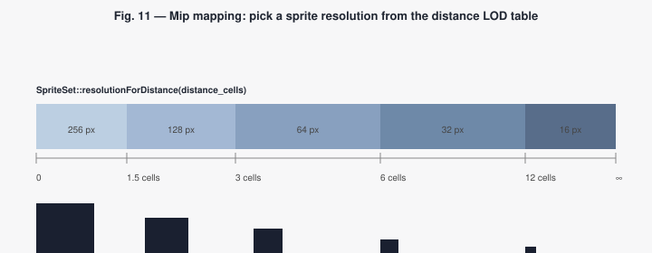

At render time, [`SpriteSet::resolutionForDistance`](../../src/engine/SpriteSet.h#L60) and `closestAvailableResolution` resolve the right size; the loader builds the necessary `Texture` objects up front, so the inner loop only does the lookup. The same selector drives the editor's preview slider (§ XII) so authors can see exactly which resolution the engine will pick at a given distance.

A sample LOD section from a sprite set:

```json
"lod": [
  { "maxDistance": 1.5,  "resolution": 256 },
  { "maxDistance": 3.0,  "resolution": 128 },
  { "maxDistance": 6.0,  "resolution": 64  },
  { "maxDistance": 12.0, "resolution": 32  },
  { "maxDistance": 9999, "resolution": 16  }
]
```

## VIII. The JSON world format

The modern world format is JSON, defined by [`WorldJsonLoader`](../../src/engine/WorldJsonLoader.h) and parsed in [`WorldJsonLoader.cpp`](../../src/engine/WorldJsonLoader.cpp). It replaces the legacy `world.ini` representation that came with the 2006 article. The loader rejects anything that is not `"format": "winraycast.world"` at `"version": 2`, so the schema can evolve without breaking shipped worlds.

A JSON world declares:

- a top-level **format** and **version** header;
- a **grid** descriptor (columns, rows, `cellWidth`, `cellDepth`, `defaultWallHeight` in world units);
- a **playerStart** in cell coordinates with a facing angle in degrees;
- a **textures** map from a two-hex-digit *texture key* to a file name (`.bmp` and `.png` are both accepted; the loader strips the extension);
- a **blocks** map from a two-hex-digit *block id* to a `BlockDefinition` (a block may carry an optional `door`, see § XI.2);
- a **cells** matrix of block ids;
- optional **spriteSets** (paths to sprite metadata files) and **spriteInstances** (static props, item pickups, and actors — § X);
- optional gameplay declarations: **playerStats**, **playerTurn**, **playerWeapons** (§ XI.1), **backgroundMusic** (§ XI.4), a **messageLog** template block (§ XI.3), and one or more **layers** (§ XI.5).

The crucial shift from the legacy model is that a cell is no longer just a packed integer encoding one wall texture. It is a reference to a *named block type* with multiple wall spans, per-cell floor and ceiling surfaces, an optional horizon image, and a collision flag per span. The same block can be reused across hundreds of cells, and an editor can rename, clone, or recolour it as a single asset.

### VIII.1 The anatomy of a block

Figure 11 shows one block — a transparent corridor with a solid lintel — both as a JSON snippet and as a side-view illustration. Either form contains exactly the same information.

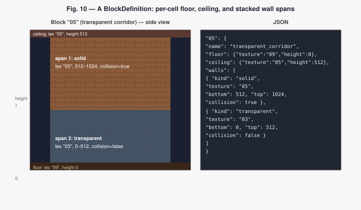

In code, each `WallSpan` in [`WorldBlock.h`](../../src/engine/WorldBlock.h) carries exactly those five fields:

```cpp
struct WallSpan {
    MapCell::TextureKey textureKey = 0;
    int32_t bottom = 0;
    int32_t top    = 0;
    WallSpanKind kind = WallSpanKind::Solid;
    bool collision = true;
};
```

The loader pre-computes `hasAnySolidSpan` and `hasAnyTransparentSpan` on each block so that the inner-loop tests in [`RayCaster::castSolidWallRay`](../../src/engine/RayCaster.cpp) and [`WorldMap::isSolidAtWorld`](../../src/engine/WorldMap.h) only do one boolean check per cell.

### VIII.2 A full world fragment

A minimal but realistic world declaration looks like the following:

```json
{
  "format": "winraycast.world",
  "version": 2,
  "name": "demo_corridor",
  "grid": {
    "columns": 4,
    "rows": 3,
    "cellWidth": 512,
    "cellDepth": 512,
    "defaultWallHeight": 512
  },
  "playerStart": { "xCell": 1.5, "yCell": 1.5, "facingDegrees": 0 },
  "textures": {
    "01": { "name": "wall_solid",     "file": "textures/wall.png" },
    "02": { "name": "floor_marble",   "file": "textures/floor.png" },
    "03": { "name": "wall_grate",     "file": "textures/grate.png" },
    "ff": { "name": "sky",            "file": "textures/sky.png"   }
  },
  "blocks": {
    "00": {
      "name": "solid_wall",
      "walls": [
        { "kind": "solid", "texture": "01", "bottom": 0, "top": 512, "collision": true }
      ]
    },
    "01": {
      "name": "open_floor",
      "floor":   { "texture": "02", "height": 0   },
      "ceiling": { "texture": "ff", "height": 512 },
      "horizonImage": "textures/sky.png"
    }
  },
  "cells": [
    ["00","00","00","00"],
    ["00","01","01","00"],
    ["00","00","00","00"]
  ]
}
```

The example above produces a single open room surrounded by solid walls, with the sky visible above the open cells.

### VIII.3 Legacy packed cells

The engine still understands the 64-bit packed-cell format from the original article. The JSON loader can carry an optional `legacyPackedCell` string on a block so the same world drives both code paths during the migration; the reverse direction is handled by `buildPackedCellFromBlock`, which synthesises a packed cell from the block's spans, ceiling and floor. New worlds should prefer block definitions — the packed layout cannot grow new fields without sacrificing existing ones — but legacy fixtures keep working and several engine unit tests (notably `WorldJsonLoaderTests.ShippedDemoWorldPreservesConvertedPackedCells`) lock in the conversion.

### VIII.4 The shipped demo world package

The reference world ships under [`res/worlds/demo_embedded/`](../../res/worlds/demo_embedded/) and demonstrates every feature listed so far. Its tree is shown in Figure 12.

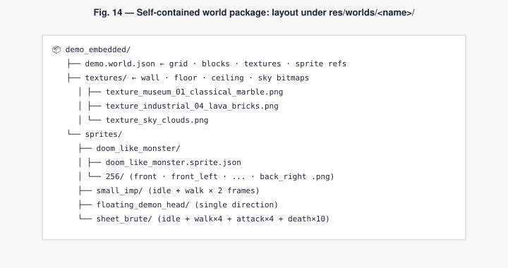

A world package is the unit of distribution: dropping a different folder under `res/worlds/` and pointing the executable at it is enough to ship a new map — the engine resolves all texture and sprite paths relative to the package root.

## IX. Multi-frame sprite animations

The 2006 engine could render one sprite frame per direction. The current code generalises that to a stack of clips on top of the directional table, illustrated in Figure 13 for `sheet_brute`'s walk cycle.

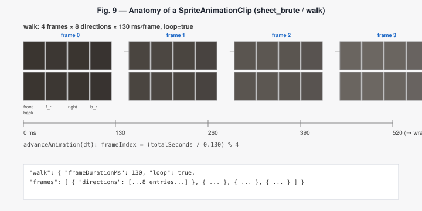

The runtime model is in [`Sprite.h`](../../src/engine/Sprite.h):

```cpp
struct SpriteAnimationClip {
    std::string name;                                  // "idle", "walk", "attack", "death"
    DirectionalSpriteFrames frames;                    // single-frame fallback (per direction)
    std::vector<DirectionalSpriteFrames> frameSets;    // per-frame directional views
    double frameDurationMs = 0.0;
    bool loop = true;
};

struct Sprite {
    /* … position, facing, scale, transparency … */
    DirectionalSpriteFrames frames;                    // static pose
    std::vector<SpriteAnimationClip> animations;       // named clips
    std::string activeAnimation = "idle";
    double animationTimeSeconds = 0.0;
    size_t animationFrameIndex = 0;
};
```

`DirectionalSpriteFrames` is the 8-view directional table used in the original engine — a vector of `SpriteFrame`s where `selectViewIndex` picks the right slot by comparing the camera-to-sprite angle with the sprite's facing. A *clip* is then either:

- *static* — one `DirectionalSpriteFrames` repeated each frame (`frames` set, `frameSets` empty);
- *animated* — a list of `DirectionalSpriteFrames`, one per animation frame (`frameSets` populated).

`Sprite::setAnimation(name)` switches clips and resets the frame index/time. `Sprite::advanceAnimation(deltaSeconds)` integrates time and computes `animationFrameIndex` from `frameDurationMs`, with the loop/clamp policy chosen by the clip:

```cpp
void advanceAnimation(double deltaSeconds) noexcept {
    if (deltaSeconds <= 0.0) return;
    animationTimeSeconds += deltaSeconds;

    const auto* clip = animation(activeAnimation);
    if (clip == nullptr || clip->frameDurationMs <= 0.0 || clip->frameSets.empty()) {
        animationFrameIndex = 0;
        return;
    }
    const double frameDurationSeconds = clip->frameDurationMs / 1000.0;
    const size_t computed = size_t(animationTimeSeconds / frameDurationSeconds);
    animationFrameIndex = clip->loop
        ? computed % clip->frameSets.size()
        : std::min(computed, clip->frameSets.size() - 1);
}
```

`Sprite::activeFrames()` then returns the directional table for the current frame, and the renderer uses it exactly as before — the change is invisible to the inner rendering loop.

### IX.1 Sprite metadata file

Sprite sets are loaded by [`SpriteMetadataLoader`](../../src/engine/SpriteMetadataLoader.h) from a JSON document that mirrors the runtime model. A compact example for an idle-only sprite:

```json
{
  "spriteSet": "small_imp",
  "format": "PNG",
  "transparentColor": [0, 0, 0],
  "supportedResolutions": [64, 128, 256],
  "defaultResolution": 128,
  "animations": {
    "idle": {
      "frameDurationMs": 200,
      "loop": true,
      "directions": [
        { "name": "front",       "angle":   0, "files": { "256": "256/front.png" } },
        { "name": "front_right", "angle":  45, "files": { "256": "256/front_right.png" } },
        { "name": "right",       "angle":  90, "files": { "256": "256/right.png" } },
        { "name": "back_right",  "angle": 135, "files": { "256": "256/back_right.png" } },
        { "name": "back",        "angle": 180, "files": { "256": "256/back.png" } },
        { "name": "back_left",   "angle": 225, "files": { "256": "256/back_left.png" } },
        { "name": "left",        "angle": 270, "files": { "256": "256/left.png" } },
        { "name": "front_left",  "angle": 315, "files": { "256": "256/front_left.png" } }
      ]
    }
  },
  "lod": [
    { "maxDistance": 3.0,  "resolution": 256 },
    { "maxDistance": 9999, "resolution": 128 }
  ]
}
```

A multi-frame clip replaces `directions` with `frames`, a list of frames each holding its own 8-direction array.

### IX.2 Example: `sheet_brute`

The [demo world](../../res/worlds/demo_embedded/) ships a `sheet_brute` actor with four clips:

| Clip      | Frames | Frame duration | Loop | Asset folder          |
|-----------|-------:|---------------:|:----:|-----------------------|
| `idle`    |      1 |       180 ms   |  ✓   | `256/`                |
| `walk`    |      4 |       130 ms   |  ✓   | `256_walk_{0..3}/`    |
| `attack`  |      4 |       110 ms   |  ✓   | `256_attack_{0..3}/`  |
| `death`   |     10 |       120 ms   |  ✗   | `256_death/death_{00..09}.png` |

Each non-death clip has 4 × 8 = 32 PNGs at 256 px (4 frames × 8 directions); the death clip is direction-agnostic (the brute collapses onto its side and the same frame is used regardless of viewing angle). The metadata file [`sheet_brute.sprite.json`](../../res/worlds/demo_embedded/sprites/sheet_brute/sheet_brute.sprite.json) is the source of truth for the editor and the engine alike. When the demo loads, `WinRayCast.cpp::Setup3DEngine` calls `buildDirectionalFrames` once per clip and once per frame, registers the resulting textures with the world, and pushes the assembled `Sprite` into the engine. From that point on, switching from `idle` to `walk` is a one-line call from the actor system.

## X. Actor system, AI, and combat

A sprite by itself just sits there. The [`ActorSystem`](../../src/engine/ActorSystem.h) is the small state machine that drives the demo's enemies. Every sprite that opts into AI (via the `chasePlayer` flag in the world JSON, or any sprite carrying health/attack data) gets a parallel `SpriteActor`:

```cpp
enum class ActorState { Idle, Patrolling, Chasing, Returning, Attacking };

struct SpriteActor {
    size_t      spriteIndex = 0;
    std::string persistenceKey;                 // survives layer/level switches
    ActorState  state = ActorState::Idle;
    double      homeX = 0.0, homeY = 0.0;
    bool        hasHomePosition = false;
    double      speedCellsPerSecond = 0.0;
    double      detectionRadiusCells = 0.0;
    double      patrolRadiusCells = 0.0;
    double      engagementHysteresisCells = 0.5;
    bool        patrolCircuit = false;
    bool        chasePlayer = true;
    int         patrolDirection = 0;
    double      stoppingDistanceCells = 0.0;
    bool        collidesWithWorld = true;
    // Combat
    double      maxHealth = 0.0, health = 0.0;
    double      attackDamage = 0.0;
    bool        rangedAttack = false;           // melee at stopping distance vs. fire from range
    double      attackRangeCells = 0.0;
    double      attackCooldownSeconds = 1.0;
    double      attackFovDegrees = 70.0;
    int         attackBurstShots = 3;           // ranged actors fire in bursts
    double      attackBurstPauseSeconds = 1.2;
    // Weapon-noise alert (see § XI.1)
    double      noiseAlertSecondsRemaining = 0.0;
    double      noiseAlertRadiusCells = 0.0;
    bool        dead = false;
    bool        deathAnimationStarted = false;
};
```

The state machine is illustrated in Figure 14.

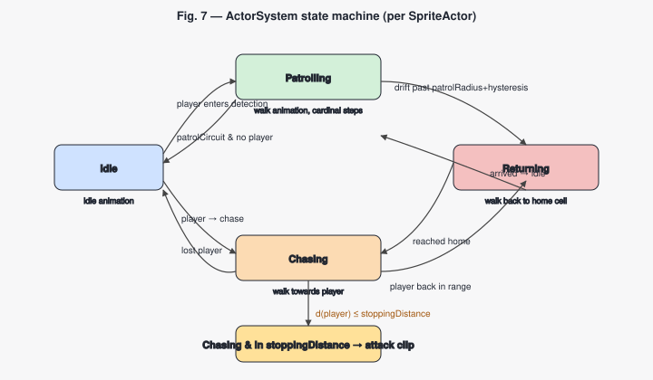

`ActorSystem::update` in [`src/engine/ActorSystem.cpp`](../../src/engine/ActorSystem.cpp) implements the transitions. For each actor per tick:

1. **Home anchoring.** First update captures the spawn position into `(homeX, homeY)` and the initial patrol direction from `sprite->facingRadians`. The actor never strays farther than `patrolRadiusCells` from this anchor unless commanded to chase.
2. **Out-of-leash recovery.** If `spriteHomeDistance > patrolRadius + hysteresis`, the actor goes into `Returning` and moves towards `(homeX, homeY)`. The animation switches to `walk` (or `idle` if `walk` is missing); on arrival, it falls back to `idle`.
3. **Engagement.** If the player is within `detectionRadius` from the actor (or within `patrolRadius` from home, when configured), the actor enters `Chasing` and steps towards the player at `speedCellsPerSecond`. The two radii combined with `engagementHysteresisCells` provide a "stickiness" band: once chasing, the actor keeps chasing slightly past the disengagement radius, so it does not flicker between states on the boundary.
4. **Attack at stopping distance.** When the actor reaches `stoppingDistanceCells` of the player, it enters `Attacking`: it stays put, turns to face the player exactly (`facingRadians = atan2(dy, dx)`), and switches the active animation to `attack` with `idle` as fallback. Sprites without an `attack` clip degrade gracefully to `idle`.
5. **Combat.** A *melee* actor (`rangedAttack = false`) hurts the player by `attackDamage` once it is in stopping range and its `attackCooldownSeconds` has elapsed. A *ranged* actor stops at `attackRangeCells`, checks the player is inside `attackFovDegrees`, and fires a burst of `attackBurstShots` rounds spaced by `attackBurstPauseSeconds`, then waits out the cooldown. Player weapon fire reduces an actor's `health`; at zero the actor is marked `dead`, plays its non-looping `death` clip once, and stops participating in combat.
6. **Patrol circuit.** When the player is not engaged and `patrolCircuit = true`, the actor walks along the cardinal directions inside `patrolRadius`, turning when it hits a solid or transparent wall. Direction is encoded as an integer 0–3 (east, south, west, north), and `kPatrolDirections` provides the unit vectors. Walking sets `facingRadians` so the directional sprite view matches the movement.
7. **Animation tick.** Every branch calls `sprite->advanceAnimation(deltaSeconds)` so the multi-frame clips integrate time correctly. The demo's main loop additionally calls `RaycastEngine::advanceSpriteAnimations(deltaSeconds, actorSpriteIndices)` on the *remaining* sprites (those not driven by the actor system), so static decorative sprites also animate without double-stepping the actor-controlled ones.

### X.1 The weapon-noise alert

Detection is not purely line-of-sight: firing a weapon makes *noise*. When the player fires, the demo calls `alertActorsFromWeaponNoise`, which widens every nearby actor's effective detection radius for a few seconds. The radius scales with the weapon and is clamped to a sane band (roughly 8–24 cells), and the alert is held in `noiseAlertSecondsRemaining` / `noiseAlertRadiusCells` on each actor. While the timer is running, an idle or patrolling enemy that would not otherwise have seen the player can wake up and start chasing — so a loud weapon trades reach for stealth. The mechanic is implemented in the demo's main loop ([`src/app/WinRayCast.cpp`](../../src/app/WinRayCast.cpp)) on top of the per-actor fields above.

The radii, hysteresis, stopping distance, combat numbers, and `patrolCircuit` flag are all per-instance fields in the world JSON, so authoring an actor is a matter of choosing numbers — no code change required:

```json
{
  "name": "sheet_brute_patrol",
  "spriteSet": "sheet_brute",
  "xCell": 5.5,
  "yCell": 5.5,
  "facingDegrees": 180,
  "scaleCells": 0.75,
  "collisionRadiusCells": 0.2,
  "chasePlayer": true,
  "speedCellsPerSecond": 0.55,
  "detectionRadiusCells": 2.25,
  "patrolRadiusCells": 3.5,
  "engagementHysteresisCells": 0.75,
  "patrolCircuit": true,
  "stoppingDistanceCells": 0.7,
  "maxHealth": 60,
  "health": 60,
  "attackDamage": 12,
  "rangedAttack": false,
  "attackRangeCells": 0,
  "attackCooldownSeconds": 1.0,
  "attackFovDegrees": 70,
  "attackBurstShots": 3,
  "attackBurstPauseSeconds": 1.2
}
```

Item pickups reuse the same `spriteInstances` array: a decorative or interactive sprite carries `passThroughWalls`, an optional `pickupHealth` (a medikit), and an `unlocksMap` flag (the computer that turns the minimap on). Ammo and key pickups are recognised from the sprite set. None of these chase the player; they are walked into.

## XI. The gameplay layer: weapons, doors, HUD, and audio

The engine library renders and the actor system thinks; the *game* — input, weapons, combat resolution, HUD, audio, and the window — lives in the demo application [`src/app/WinRayCast.cpp`](../../src/app/WinRayCast.cpp), with Windows-only services (audio, presentation, texture decoding) under [`src/win/`](../../src/win/). The split is deliberate: the platform-neutral core never learns about a keyboard, a sound card, or a HUD.

### XI.1 First-person weapons

A weapon the player holds is a [`ViewWeapon`](../../src/engine/ViewWeapon.h): a screen-space billboard with its own animation clips (`idle`, `fire`, `reload`), ammo state, and fire timing. It is intentionally *not* a world sprite — it is composited last, after the scene and the HUD math, anchored to the bottom of the viewport.

Each weapon carries:

- **Animations** — `idle` loops; `fire` and `reload` play once. Each clip is a list of frames plus a `frameDurationMs`.
- **Ammo** — `magazineSize`, `maxAmmo`, and a running `ammoInMagazine` / `reserveAmmo`. `consumeRound`, `reload`, `needsReload`, and `canFire` express the magazine rules; `refillAmmoToMax` is what an ammo-box pickup calls.
- **Fire behaviour** — `automaticFire` plus a `fireIntervalSeconds` cooldown, so a submachine gun keeps firing while the button is held while a pistol fires once per press. A separate `fireSoundIntervalSeconds` throttles the sound so automatic fire does not machine-gun the audio mixer.
- **Combat** — `damage` and `rangeCells`, used by the hitscan that runs on the fire frame.
- **Presentation** — `screenHeightFraction`, an `anchor` and `baseOffset`, and a weapon-**bob** (`amplitudeX/Y`, `frequencyHz`) that sways the sprite while the player moves.

`ViewWeapon::advance(deltaSeconds, playerIsMoving)` integrates the active clip and the bob phase each frame. Firing is a hitscan: when the `fire` clip's fire frame comes up, the demo's `applyViewWeaponDamage` walks outward along the view ray up to `rangeCells`, and the first actor it reaches loses `damage` health. Firing also triggers the weapon-noise alert (§ X.1). The super shotgun shows the magazine rules in action — a 2-round magazine that the demo force-reloads after the second shot.

The player can carry several weapons. The world JSON declares them in a `playerWeapons` array (with a single `playerWeapon` kept for back-compat); each entry points at a `*.weapon.json` metadata file and an on-screen size:

```json
"playerWeapons": [
  { "file": "weapons/pistol/pistol.weapon.json",          "visible": true, "screenHeightFraction": 0.48 },
  { "file": "weapons/super_shotgun/super_shotgun.weapon.json", "visible": true, "screenHeightFraction": 0.34 },
  { "file": "weapons/submachine_gun/submachine_gun.weapon.json", "visible": true, "screenHeightFraction": 0.31 }
]
```

A weapon metadata file mirrors the runtime model:

```json
{
  "weapon": "super_shotgun",
  "format": "PNG",
  "frameWidth": 512,
  "frameHeight": 512,
  "screenHeightFraction": 0.34,
  "damage": 45,
  "rangeCells": 7.5,
  "anchor": { "x": 0.5, "y": 1.0 },
  "bob": { "enabled": true, "amplitudeX": 6, "amplitudeY": 4, "frequencyHz": 3 },
  "fireBehavior": { "automatic": false, "intervalMs": 0, "soundIntervalMs": 0 },
  "ammo": { "magazineSize": 2, "maxAmmo": 14, "initialAmmo": 14 },
  "sounds": { "fire": "super_shotgun/cannon2.mp3" },
  "animations": {
    "idle":   { "frameDurationMs": 0,  "loop": true,  "files": ["super_shotgun/idle.png"] },
    "fire":   { "frameDurationMs": 70, "loop": false, "files": ["super_shotgun/fire_0.png", "..."] },
    "reload": { "frameDurationMs": 95, "loop": false, "files": ["super_shotgun/reload_00.png", "..."] }
  }
}
```

The `playerWeapons` references are resolved by [`SceneLoader`](../../src/engine/SceneLoader.h); the demo application then builds each `ViewWeapon` from its `*.weapon.json` (frames, ammo, timing), and the editor authors the same files through `WeaponMetadataLoader` (§ XII).

### XI.2 Doors and keys

Doors build on the structured block model rather than being free sprites — the design rationale is in § VII.2. A door is a `BlockDefinition` carrying a `DoorDefinition` ([`WorldBlock.h`](../../src/engine/WorldBlock.h)):

```cpp
struct DoorDefinition {
    bool        enabled = false;
    bool        blocksWhenClosed = true;
    std::string requiredKey;                          // empty = no key needed
    double      triggerDistanceCells = 1.25;
    double      openTimeSeconds = 0.45;               // open/close animation duration
    double      closeDelaySeconds = 1.0;              // dwell before auto-closing
    std::string openSound;
    int         openSoundVolumePercent = 80;
    std::vector<MapCell::TextureKey> animationTextureKeys;  // frames, played by openAmount
};
```

`WorldMap` owns the runtime door state (an `openAmount` per door cell plus a close-delay timer) and a *keyring* of the keys the player has collected. `WorldMap::updateDoors(playerX, playerY, actorPositions, deltaSeconds)` opens a door when the player (or an actor) is within `triggerDistanceCells` — provided `requiredKey` is empty or present in the keyring — animates `openAmount` toward 1, holds it open for `closeDelaySeconds` once nothing is near, then animates it shut. Movement collision follows the door state: the block blocks while closed/opening and becomes passable once open. The current animation frame is picked from `animationTextureKeys` by `openAmount`, so the transparent door panel slides as the door moves. Opening emits a `DoorEvent` that the demo turns into the door sound. In the shipped demo, key-card pickups (`item_key_red`/`green`/`blue`) add to the keyring and gate the matching doors.

### XI.3 The HUD: minimap, compass, and event log

The runtime surface is larger than the 3D viewport on purpose. The demo renders the scene into a `1024 × 768` region (`RENDER_X_RES × RENDER_Y_RES`) and reserves a right-hand band (`HUD_PANEL_X_RES = 384`) and a bottom band (`HUD_PANEL_Y_RES`) for HUD content, so no raycast work is wasted on pixels the UI will overwrite. `drawRuntimeHud` in [`WinRayCast.cpp`](../../src/app/WinRayCast.cpp) paints three things:

- **Minimap** — a top-down view of the current layer in the right band, drawn only once `g_minimapUnlocked` is set (by walking into the computer pickup, `unlocksMap`). It shows the walls, the player as a marker, key/item pickups, and — once `g_minimapActorsUnlocked` — live enemy positions.
- **Compass** — a heading line drawn from the player marker using the player's view angle, with the world's orientation convention (top of the cell matrix is north, increasing column is east, increasing row is south).
- **Teletype event log** — a bottom panel that prints short, fading lines (`> Picked up Red Key`, `> Health restored (+35)`, `> Reloading…`) newest-last, each older line dimmer than the one below it. The message templates are world-configurable through `WorldMap::MessageLogConfig` (fields `keyPickup`, `ammoPickup`, `healthPickup`, `mapUnlocked`, `mapActorsUnlocked`, `weaponReload`, `itemPickup`, with `{name}` / `{amount}` placeholders and a `maxLines` cap).

The turn feel of the camera is also world-tunable, through `playerTurn` (`baseDegreesPerSecond`, `maxDegreesPerSecond`, `accelerationDegreesPerSecondSquared`): holding a turn key ramps from the base rate up to the maximum, which keeps fine aiming precise while still letting the player spin quickly.

### XI.4 Audio

Audio is Windows-only and lives under [`src/win/`](../../src/win/). [`BackgroundMusicPlayer`](../../src/win/BackgroundMusicPlayer.h) loops a track declared in the world's `backgroundMusic` block (file, `loop`, `volumePercent`), decoding Ogg/Vorbis through [`OggVorbisDecoder`](../../src/win/OggVorbisDecoder.h). [`SoundEffectPlayer`](../../src/win/SoundEffectPlayer.h) plays one-shot effects — weapon fire (per-weapon `sounds.fire`), door opening (`DoorDefinition::openSound`), and pickups. Both are toggled at runtime (music `F9`, effects `F8`) and the music volume is adjustable (`F10`/`F11`), so the test loop can run silently.

### XI.5 Multi-layer worlds

A single world file can describe several **layers** — effectively levels — through a top-level `layers` array, with `startLayer` / `activeLayer` choosing the first one. Each layer carries its own `grid`, `playerStart`, block palette, `cells` matrix, and `spriteInstances`, so the demo world ships more than one connected level in one package. The fields at the top of the world file (player stats, weapons, music, default horizon) are world-wide defaults; the per-layer blocks describe that level's geometry. Actors carry a `persistenceKey` so an enemy's state can survive a layer switch where that is wanted. Door blocks are the natural transition trigger between layers.

## XII. The editor

The [`WinRaycastEditor`](../../tools/WinRaycastEditor/) is a .NET 8 WPF application split into three projects:

- **`WinRaycastEditor.Core`** — pure C# library, no UI dependency. Holds the in-memory document model (`EditorMapDocument`, `EditorMapCell`, `EditorSpriteInstance`), the JSON load/save services (`WorldJsonDocumentService`, `SpriteMetadataLoader`, `EditorProjectDocumentService`), the LOD selector, and the validation rules.
- **`WinRaycastEditor`** — the WPF host. Owns the view models, the MainWindow XAML, drag-and-drop handlers, and the `SpriteAnimationPlaybackController`.
- **`WinRaycastEditor.Tests`** — the MSTest suite. Both the Core API and a number of `MainWindowViewModel` scenarios are exercised here without a UI thread.

The architecture is summarised in Figure 15.

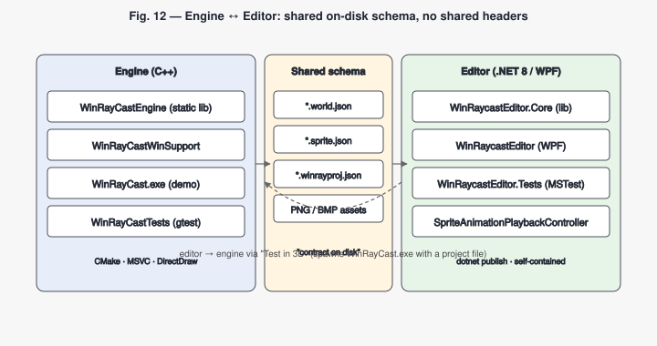

The editor never links against the C++ engine. It shares the *on-disk schema* — the same JSON world format, the same sprite metadata, and a small extension (`*.winrayproj.json`) for project files — and that is the entire integration contract. A future port of the renderer to a different language would not require rewriting the editor.

### XII.1 World editing model

The editor exposes the world as structured data: a grid of block IDs, a palette of block definitions, texture assignments per surface, wall spans with bottom/top heights, transparent versus solid render kinds, passable versus blocking movement flags, door metadata, player start, sprite sets, sprite instances, layers, and weapons. The editing unit is the *block*, not the cell — cloning a block is one click, and every cell that references it picks up the change. The MainWindow lays this out as a left-hand workbench (with `Map`, `Library`, `Sprites`, and `Help` tabs and layer-aware context panels), a right-hand grid canvas where cells render their active texture, sprite markers, the player marker, and the selection ring, an optional 3D preview tab, and a docked JSON editor pane.

### XII.2 Animation playback canvas

The Sprites tab embeds a frame-by-frame playback transport for the selected animation, shown in Figure 16.

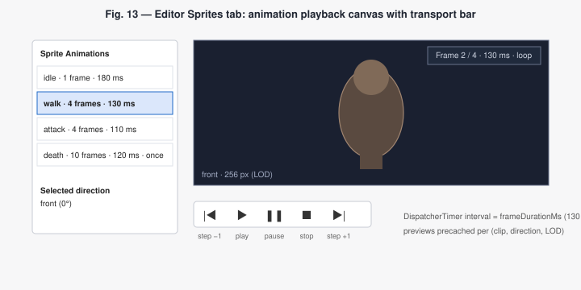

The controller [`SpriteAnimationPlaybackController`](../../tools/WinRaycastEditor/src/WinRaycastEditor/SpriteAnimationPlaybackController.cs) owns:

- a `DispatcherTimer` whose interval is set from `frameDurationMs` of the active clip;
- a cache of pre-decoded `ImageSource`s, one per frame, for the currently selected direction (with `front` as fallback);
- `CurrentPreview`, `FrameIndex`, `FrameCount`, `IsPlaying`, and a human-readable `Summary` (`Frame 2 / 4 - 130 ms/frame - loop`).

The MainWindowViewModel exposes five `RelayCommand`s — `PlayAnimationCommand`, `PauseAnimationCommand`, `StopAnimationCommand`, `StepAnimationForwardCommand`, `StepAnimationBackwardCommand` — surfaced in the XAML as a `|◀  ▶  ❚❚  ■  ▶|` transport bar. When the user changes the selected animation, selected direction, or LOD slider, the controller pauses and rebuilds its cache; mutating the animation (add/remove/duplicate frame, change frame duration, toggle loop) refreshes the cache automatically through view-model property notifications. The same canvas falls back to the static directional preview when the selection produces no playable frames.

The controller's transport contract is small enough to summarise in one block:

```csharp
public void Play()         { if (CanPlay)  { m_timer.Start(); IsPlaying = true; } }
public void Pause()        { if (IsPlaying) { m_timer.Stop();  IsPlaying = false; } }
public void Stop()         { Pause(); FrameIndex = 0; }
public void StepForward()  { Pause(); FrameIndex = WrappedNext(+1); }
public void StepBackward() { Pause(); FrameIndex = WrappedNext(-1); }
```

with `WrappedNext` honouring the clip's `Loop` flag (clamping at the last frame for non-looping clips). The same transport is reused for weapons: a parallel `WeaponAnimationPlaybackController` previews a `*.weapon.json`'s `idle` / `fire` / `reload` clips so a weapon's timing can be tuned without launching the engine.

### XII.3 Inline sprite rename and drag-and-drop

Two interactions added recently mirror common map-editor gestures:

- **Inline rename.** The Map tab's Sprite Editing panel exposes a text box bound to `SelectedSprite.Name`, so renaming an actor is a single edit without leaving the map context.
- **Drag-and-drop.** The same `DragDrop.DoDragDrop` machinery used for sprites is wired to the player marker. `PlayerDrag_PreviewMouseLeftButtonDown` and `PlayerDrag_MouseMove` (in [`MainWindow.xaml.cs`](../../tools/WinRaycastEditor/src/WinRaycastEditor/MainWindow.xaml.cs)) initiate a drag with a dedicated `PlayerDragFormat`; `MapCell_Drop` accepts that format and calls `MainWindowViewModel.MovePlayerToCell`, which records an undoable `PlayerStartUndoAction`. The result: drag the `P` badge from one cell to another and the player start moves, with Ctrl+Z restoring the previous position.

### XII.4 Weapon authoring and the JSON editor

Two more authoring surfaces round out the editor:

- **Weapon authoring.** `WeaponMetadataLoader` / `WeaponMetadataWriter` / `WeaponMetadataDocument` (in `WinRaycastEditor.Core`) round-trip a `*.weapon.json`, so weapons can be edited and previewed (animations, ammo, damage, bob) alongside sprites and blocks, with the same JSON-faithful save path the world format uses.
- **Inline JSON editor.** A docked, syntax-aware JSON pane (`JsonEditorPanelViewModel`, backed by a Scintilla host) shows the underlying document and keeps the structured editor and the raw text in sync — `JsonSpanLocator` maps a selected object back to its byte span, and `JsonEditingBackupService` guards against a bad hand-edit. Texture import (`TextureImport`) brings external bitmaps into a world package and rewrites the palette to package-relative paths.

### XII.5 Test-in-3D launcher

The `Test in 3D` menu item exports the currently-loaded document to a temporary `preview.winrayproj.json` and launches `WinRayCastPlayer.exe` with that project as the command-line argument. The player resolves the project, loads the world JSON, and runs it. Round-tripping through the on-disk schema is the canonical way to validate that the editor and the engine still agree on a world.

## XIII. Build, packaging, and distribution

The build system is CMake (3.20+). Four targets are declared in [`CMakeLists.txt`](../../CMakeLists.txt):

- `WinRayCastEngine` — static library, no Windows dependencies;
- `WinRayCastWinSupport` — static library wrapping DirectDraw, BMP/PNG loading, and the frame presenter;
- `WinRayCastPlayer` — the FPS world player executable;
- `WinRaycastEditorPublish` — a custom target that runs `dotnet publish` to produce a self-contained, single-file `WinRaycastEditor.exe`.

The Visual Studio presets (`vs2026-x64`, `vs2026-win32`, `vs2022-x64`, `vs2022-win32`) generate one solution that contains both the C++ engine projects and the C# editor projects (via `include_external_msproject`), so opening the generated `.slnx` shows the whole workspace.

A typical build cycle:

```powershell
cmake --preset vs2026-x64
cmake --build --preset vs2026-x64-release
cpack --config out/build/vs2026-x64/CPackConfig.cmake -C Release
```

The CPack section assembles a redistributable bundle:

- `WinRayCastPlayer.exe`,
- `res/worlds/demo_embedded/` (the self-contained world package: layer/world JSON, textures, sprite metadata and bitmaps, weapon definitions, sound effects, background music, and HUD frames),
- `editor/WinRaycastEditor.exe` (no .NET runtime required on the target machine),
- `LICENSE.txt`.

Two generators are configured: NSIS (Windows installer `.exe`, with three Start-menu shortcuts — *WinRayCast (default world)*, *WinRayCast (demo world)*, *WinRaycast Editor* — and an uninstaller) and ZIP (portable archive).

## XIV. Testing

The engine ships a gtest-based suite of 14 test files under [`tests/`](../../tests/), built when `BUILD_TESTING=ON` (the CMake default). The suite covers:

- **Per-class unit tests** — `ColumnDepthBufferTests`, `FrameBufferTests`, `MapCellTests`, `RayCasterTests`, `RaycastEngineSpriteTests`, `SceneLoaderTests`, `SpriteMetadataLoaderTests`, `SpriteSetTests`, `SpriteProjectionTests`, `SpriteTests`, `TextureTests`.
- **World-level regression** — `WorldJsonLoaderTests` opens the shipped demo world and asserts on its sprite-set count, sprite instances, packed-cell preservation, and the presence of multi-block-high walls.
- **Actor behaviour** — `ActorSystemTests` covers chase, patrol turn-on-wall, hysteresis-band stickiness, return-to-home, transparent-wall-as-boundary, and attack-at-stopping-distance.
- **Weapons** — `ViewWeaponTests` covers the magazine/reserve ammo rules, reload, semi-auto vs. automatic fire timing, and animation advancement.

A representative test, for the attack transition:

```cpp
TEST(ActorSystemTests, ChasingActorPlaysAttackAtStoppingDistance) {
    auto map = makeOpenMap();
    Player player(0, 0, 60, 60, 40);
    player.setPos({ 120.0, 96.0 });

    auto sprite = makeActorSprite();
    sprite.animations.push_back(
        SpriteAnimationClip("attack", DirectionalSpriteFrames({{4}}), {}, 110.0, true));
    RaycastEngine engine(player, 250000);
    engine.addSprite(sprite);

    std::vector<SpriteActor> actors = { makeChasingActor() };
    ActorSystem actorSystem;
    actorSystem.update(engine, map, actors, 1.0);

    EXPECT_EQ(ActorState::Idle, actors[0].state);
    EXPECT_EQ("attack", engine.sprites()[0].activeAnimation);
}
```

The editor ships its own MSTest suite under [`tools/WinRaycastEditor/src/WinRaycastEditor.Tests/`](../../tools/WinRaycastEditor/src/WinRaycastEditor.Tests/). It exercises the Core library (world/sprite/weapon loaders and writers, sprite resolution and LOD selection, the legacy converter, validation, JSON span location and editing backup, layer sprite round-trips, texture import) and a number of view-model scenarios (undo/redo for cell edits and player start moves, paste/copy of sprites and cells, sprite animation editing, the block palette, drag-and-drop of the player marker).

The two suites are independent — gtest produces a Win32 `.exe`, MSTest produces a .NET DLL — and both run from a clean clone with the same `cmake --build` invocation.

## XV. Conclusion

WinRaycast was constructed to strike a balance between performance and code comprehensibility, and that constraint still drives every decision. The 2006 article described a single-author demo that fit in a magazine listing. The 2026 codebase is bigger — multi-layer JSON worlds, multi-frame animations, an AI loop with combat, first-person weapons, interactive doors, a HUD, audio, an editor, a packaged installer — but every addition has been made under the same rule: the per-column rendering core remains short, the data model carries the new complexity, the gameplay lives in the demo application rather than the engine core, and the editor sits on the schema, not on the C++ API.

There is still room to push the model further. Wall spans could subsume the legacy "upper wall" branch entirely; floors and ceilings could acquire variable heights to enable balconies and pits; the colour-key transparency could grow into a full alpha channel; the actor system could grow line-of-sight and group behaviour on top of its existing health and attack model; layer-to-layer transitions could become a first-class session concept; and the HUD overlay could be lifted out of the Win32 demo into backend-neutral draw commands. None of these are blocked by the current architecture — they would extend it rather than break it.

The accompanying article remains the primary reference for the core algorithm; this document is its companion for everything that has been added since.

## References

- [1] A. Calderone, "Ray casting, engine 3d e videogame", *Computer Programming* #157, Infomedia, May 2006. English revision: *Ray Casting in 3D Game Engines* (2023).
- [2] POV-Ray: Persistence of Vision Raytracer. https://www.povray.org/
- [3] Blender — A 3D Modelling and Rendering Package. https://www.blender.org/
- [4] id Software, *Wolfenstein 3D* (1992) and *Doom* (1993) — historical references for grid-based ray casting and billboard sprites.
- [5] nlohmann/json — JSON parser used by `WorldJsonLoader` and `SpriteMetadataLoader`. https://github.com/nlohmann/json
- [6] Google Test (gtest) — engine test framework. https://github.com/google/googletest
- [7] MSTest — editor test framework. https://learn.microsoft.com/dotnet/core/testing/unit-testing-with-mstest

## About the author

Antonino Calderone has worked for years in the software industry with companies such as Cisco, Microsoft, Workday, McAfee, Intel, and Ericsson, in roles ranging from Technical Leader to Senior and Principal Software Engineer, and Security Architect. Alongside his industry work he supports open source and publishes his projects at https://www.eantcal.eu. He wrote for the Italian *Computer Programming* magazine in the 1990s and 2000s — the original 2006 article behind WinRaycast appeared in issue #157. He studied Computer Engineering and Electronics and has been involved in research; one of his papers won an award at the 2021 AEIT International Conference on Electrical and Electronic Technologies for Automotive.

---

*Refined source for this document and the engine: https://github.com/eantcal/Winraycast.*
